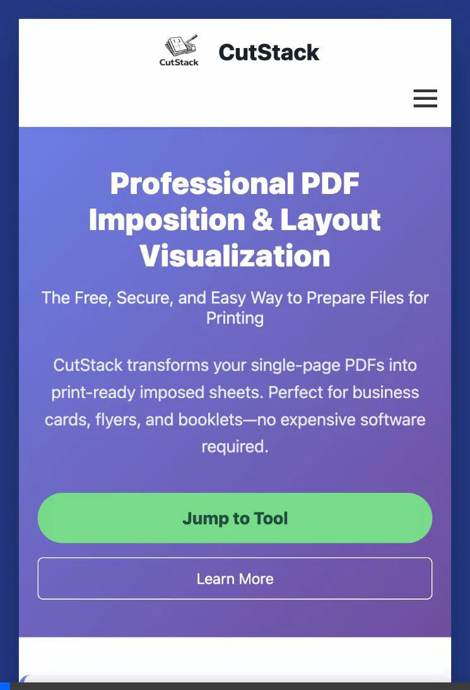
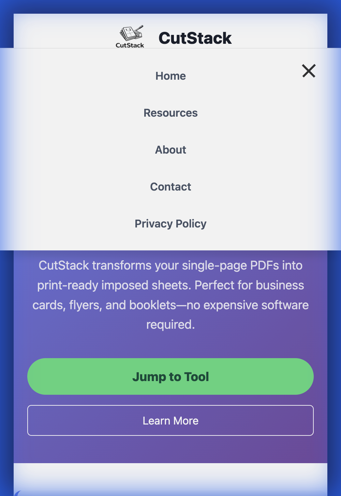

# CutStack ✂️📄

CutStack is a Flask-based web application designed to help with PDF imposition. It allows you to impose multiple PDF pages onto a single sheet (N-up imposition), specifically optimized for A4 portrait printing with cut lines and page numbering.

## Features

-   **N-Up Imposition**: Support for configurable pages per sheet (default 2-up).
-   **Smart Grid Calculation**: Automatically calculates the best grid layout for your pages to minimize waste.
-   **Cut Lines**: Automatically adds dashed cut lines for easy trimming.
-   **Page Numbering**: intelligently numbers pages on the imposed sheet.
-   **Drag & Drop Interface**: Simple and intuitive UI for uploading files.
-   **Sequential Layout**: Handles front and back side imposition order for correct stacking.

## Demo & Mobile Responsiveness

CutStack checks for mobile responsiveness to ensure a smooth experience on all devices.

### Mobile Menu & Navigation

*Top: Functional hamburger menu and smooth navigation toggle.*

### Responsive Layout

*Top: Content stacking and responsive typography.*


*Snapshot of the accessible mobile navigation.*

## Prerequisites

-   Python 3.8+
-   pip (Python package manager)

## Installation

1.  Clone the repository:
    ```bash
    git clone https://github.com/Sreyas-2003/CutStack.git
    cd CutStack
    ```

2.  Install dependencies:
    ```bash
    pip install -r requirements.txt
    ```

## Usage

1.  Start the application:
    ```bash
    python app.py
    ```

2.  Open your browser and navigate to `http://localhost:8000`.

3.  Upload your PDF file and select the number of pages per sheet (N-up).

4.  Click "Process" to download the imposed PDF.

## Tech Stack

-   **Backend**: Flask (Python)
-   **PDF Processing**:  `pypdf`, `reportlab`
-   **Frontend**: HTML, CSS, JavaScript

## License

This project is licensed under the MIT License.
